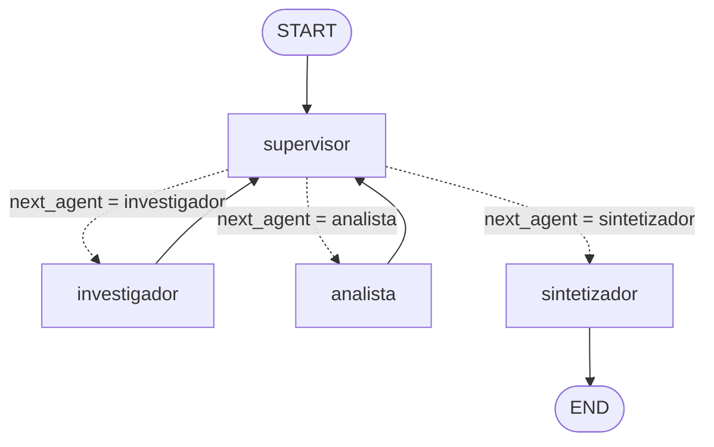
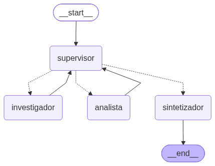

# Pre-entrega 6: Orquestador multi-agente especializado

Prototipo de un **Orquestador Multi-Agente de Análisis e Investigación** construido con **LangGraph** sobre los
datos de **GenPet** (la empresa ficticia de paños higiénicos para mascotas de la Pre-entrega 5).

Una consulta del usuario que necesita **investigación** (buscar datos en fuentes) y **análisis** (calcular sobre esos
datos) se resuelve así:

1. El **Supervisor** decide quién interviene.
2. El **Investigador** busca los datos en la base de conocimiento de GenPet.
3. El **Analista** los procesa con herramientas de cálculo.
4. El Supervisor valida los aportes con una **rúbrica** + **guardas deterministas** y, cuando todo cumple, pasa al
   **Sintetizador**, que redacta la respuesta final.

La consigna original está en [`CONSIGNA.md`](CONSIGNA.md) y la demo del flujo en [`demo.ipynb`](demo.ipynb).

## Diagrama del grafo

Generado con `graph.get_graph().draw_mermaid()` / `draw_mermaid_png()` (`python main.py --diagrama` →
[`docs/graph.mmd`](docs/graph.mmd) y [`docs/graph.png`](docs/graph.png)):





## Topología elegida: jerárquica (supervisor + especialistas)

| Decisión | Por qué |
|---|---|
| **Un supervisor central** que enruta todo | La tarea es secuencial con dependencias (sin datos no hay análisis) y necesita un único punto que valide antes de cerrar. Un solo "cerebro" hace explícito el control de flujo y la condición de parada. |
| **Los especialistas nunca hablan entre sí** | Todos devuelven el control al supervisor (`investigador → supervisor`, `analista → supervisor`). Así ningún agente puede iniciar un bucle con otro sin pasar por las guardas, y cada decisión queda registrada. |
| **Herramientas acotadas por rol** | El investigador solo busca (no tiene calculadora) y el analista solo calcula (no tiene buscador). Cada uno solo puede hacer su trabajo, lo que evita que el investigador "estime" números o que el analista "invente" datos. |
| **Sintetizador como nodo aparte** | La fase de síntesis final es un paso distinto de "decidir" (supervisor) y de "producir datos" (especialistas): integra los aportes y aplica las reglas de resolución de conflictos. |

Se descartó una topología en red (todos con todos) porque multiplica los caminos posibles, hace difícil garantizar
una condición de parada y diluye la responsabilidad de validar.

## Cómo se cumplen los requerimientos

| Requerimiento | Implementación | Archivo |
|---|---|---|
| Estado compartido estructurado | `OrchestratorState(MessagesState)` con `next_agent`, `current_instruction`, `contributions`, `decisions`, `delegations`, `task_completed`, `final_answer` | [`state.py`](state.py) |
| Rastrear qué agente aportó qué | Cada `Contribution` guarda agente, intento, instrucción recibida, respuesta, **tool calls reales** (herramienta, argumentos, resultado) y resultado de la validación. Listas con reducer `operator.add`: ningún aporte se pisa | [`state.py`](state.py), [`agents/specialist.py`](agents/specialist.py) |
| Supervisor (router + control de flujo) | LLM con salida estructurada `SupervisorDecision(next: Literal["investigador", "analista", "FINALIZAR"])`, mapeada 1:1 a nodos | [`agents/supervisor.py`](agents/supervisor.py) |
| Aristas condicionales con `Literal` | `route_from_supervisor(state) -> NextNode` donde `NextNode = Literal["investigador", "analista", "sintetizador"]` | [`agents/supervisor.py`](agents/supervisor.py), [`graph.py`](graph.py) |
| Agente de Investigación + tool | `create_agent` (sucesor de `create_react_agent` en LangChain v1) con `buscar_base_conocimiento` y `listar_documentos` (BM25 sobre el corpus de GenPet). Opcional: Tavily si hay `TAVILY_API_KEY` | [`agents/research_agent.py`](agents/research_agent.py), [`tools/`](tools/) |
| Agente de Análisis/Cómputo + tools | `create_agent` con `calcular` (evaluador aritmético seguro por AST, sin `eval`), `variacion_porcentual`, `cumplimiento_de_meta`, `estadisticas_descriptivas` | [`agents/analyst_agent.py`](agents/analyst_agent.py), [`tools/math_tools.py`](tools/math_tools.py) |
| Validación antes del `END` | Rúbrica en el prompt del supervisor (cobertura, trazabilidad, cómputo verificado, consistencia) + validación determinista de montos + guardas | [`agents/supervisor.py`](agents/supervisor.py), [`agents/validation.py`](agents/validation.py) |
| Fase de síntesis final | Nodo `sintetizador` con reglas de resolución de conflictos | [`agents/synthesizer.py`](agents/synthesizer.py) |

## Validación y control de flujo

El supervisor es un LLM y puede equivocarse, así que la validación tiene tres capas:

1. **Rúbrica del supervisor** (prompt): no se elige `FINALIZAR` si falla alguno de estos puntos:
   *cobertura* (cada parte de la consulta tiene datos), *trazabilidad* (fuentes citadas y validación automática OK),
   *cómputo verificado* (revisa el **registro real de tool calls** del analista, no su autodescripción) y
   *consistencia* (el analista usó los valores del investigador; ninguna META se usa como resultado REAL).
2. **Validación determinista de grounding** ([`agents/validation.py`](agents/validation.py)): cada monto que reporta
   el investigador tiene que aparecer literalmente en los documentos. Detecta, por ejemplo, que "objetivo anual
   $36.500.000" es una suma inventada (la fuente dice "superar los $36.000.000").
3. **Guardas** (`apply_guards`, código puro y testeado) que pisan la decisión del LLM cuando hace falta:

| Guarda | Qué hace |
|---|---|
| Aporte no validado | Si el último aporte del investigador tiene montos que no están en las fuentes, se le pide corregirlo antes de seguir |
| Análisis desactualizado | Si el investigador aportó datos **después** del analista y el supervisor quiere cerrar, el analista recalcula |
| Analista sin datos | Si el supervisor manda al analista sin datos previos, se redirige al investigador |
| Máximo por agente | `MAX_CALLS_PER_AGENT = 3` intentos por especialista. Si el investigador se agota y nadie analizó, se analiza lo disponible; si no, se sintetiza |
| Máximo global | `MAX_DELEGATIONS = 6` delegaciones; al llegar, se sintetiza con lo que haya |
| Respaldo | `recursion_limit` de LangGraph en cada invocación (y uno propio para el loop ReAct de cada especialista) |

Las decisiones forzadas quedan marcadas con `forced=True` en `decisions` (y `[GUARDA]` en la traza).

### Cómo se evita el "Supervisor infinito"

- Contadores en el estado (`delegations` y aportes por agente) con topes fijos en [`config.py`](config.py).
- **Criterio de suficiencia** en el prompt: no se vuelve a pedir un dato que el investigador declaró "no encontrado",
  no se piden datos reales de períodos que no terminaron y no se piden refinamientos por estilo.
- Test: [`test_supervisor_infinito_se_corta_con_las_guardas`](tests/test_graph.py): un supervisor que **siempre**
  pide más investigación termina igual en la síntesis.

### Cómo se evita la contaminación de contexto

- Cada especialista corre su propio agente ReAct con un **historial nuevo** por tarea: recibe solo el objetivo del
  usuario, la instrucción concreta del supervisor y los aportes que necesita.
  - El **investigador** ve solo sus propios aportes previos (para refinarlos).
  - El **analista** ve los aportes del investigador y los suyos.
- Los tool calls internos de un especialista **no** se vuelcan al historial compartido: al estado sube solo su
  respuesta final (y el registro resumido de tool calls, que ve el supervisor).
- El supervisor no ve el historial crudo de mensajes: ve la consulta, los aportes con su evidencia y el presupuesto
  de delegaciones restante.

## Manejo de conflictos entre agentes

| Conflicto | Resolución |
|---|---|
| El analista calculó con datos viejos | Guarda "análisis desactualizado": recalcula con el último aporte del investigador |
| El investigador reporta un monto que no está en las fuentes | Validación determinista + guarda: se corrige antes de analizar |
| Un dato de origen contradice a un número derivado | Sintetizador: los **datos de origen** (montos, metas, fechas) los define el investigador (fuente citada); los **números derivados** (porcentajes, diferencias, totales) los define el analista (calculados con herramientas) |
| Contradicción que esas reglas no resuelven | El sintetizador muestra ambos valores y lo aclara; nunca elige uno inventando |
| META confundida con resultado REAL | El investigador etiqueta cada dato `[REAL]` o `[META]`; la rúbrica y el sintetizador prohíben usar una meta como resultado |
| Falta información | Se declara en "Datos no encontrados" y el sintetizador lo informa; no se completa con supuestos |
| Salida estructurada inválida del supervisor | Se cierra con lo disponible (los errores de API/red/créditos, en cambio, se propagan para no ocultarlos) |

## Demo del flujo de delegación

- **Notebook:** [`demo.ipynb`](demo.ipynb) (ya ejecutado, con salidas). Muestra el grafo, corre la consulta de demo
  con el LLM real, imprime quién aportó qué (con sus tool calls) y la respuesta final; al final demuestra la guarda
  contra el supervisor infinito con modelos falsos.
- **Trazas guardadas:** [`traces/demo.log`](traces/demo.log) / [`traces/demo.json`](traces/demo.json).

Flujo obtenido con la consulta de demo (`openai/gpt-4.1-mini` vía OpenRouter):

```text
[1] supervisor -> investigador      # "buscá ingresos reales Q1-Q3, metas Q1-Q4 y objetivo anual"
[2] investigador (intento 1) · 8 tool calls (buscar_base_conocimiento)     validación: OK
[3] supervisor -> analista          # "con estos valores calculá crecimiento, cumplimiento y faltante"
[4] analista (intento 1) · 8 tool calls (variacion_porcentual, cumplimiento_de_meta, calcular)
[5] supervisor -> sintetizador      # rúbrica OK
[6] sintetizador -> END             # falta facturar $9.238.558 en Q4; cumpliendo la meta del Q4 se supera el objetivo anual
```

## Estructura

```text
6- Entrega/
├── README.md                # Este archivo
├── CONSIGNA.md              # Consigna original
├── demo.ipynb               # Demo ejecutada del flujo de delegación
├── requirements.txt         # Dependencias (versiones fijadas)
├── .env.example             # Plantilla de variables de entorno
├── pytest.ini
│
├── config.py                # Configuración: rutas, topes del orquestador y settings del LLM
├── llm.py                   # Factory del chat model (openai | anthropic | gemini | openrouter)
├── state.py                 # OrchestratorState(MessagesState), Contribution, RoutingDecision, ToolCallRecord
├── graph.py                 # StateGraph: nodos, aristas condicionales y create_orchestrator()
├── runner.py                # run_query(): ejecuta el grafo y alimenta la traza
├── tracing.py               # TraceRecorder: traza legible (.log) y estructurada (.json)
├── diagram.py               # Exporta el grafo a Mermaid (.mmd) y PNG
├── main.py                  # CLI
│
├── agents/
│   ├── supervisor.py        # Prompt con rúbrica, SupervisorDecision, guardas, nodo y función de ruteo
│   ├── research_agent.py    # Agente de Investigación (create_agent + tools de búsqueda)
│   ├── analyst_agent.py     # Agente de Análisis (create_agent + tools de cómputo)
│   ├── synthesizer.py       # Síntesis final con reglas de conflicto
│   ├── specialist.py        # Nodo genérico de especialista (contexto acotado + registro del aporte)
│   ├── validation.py        # Validación determinista de montos contra las fuentes
│   └── context.py           # Armado del contexto mínimo de cada nodo
│
├── tools/
│   ├── knowledge_base.py    # BM25 sobre data/docs + tools buscar_base_conocimiento / listar_documentos
│   ├── math_tools.py        # calcular (AST seguro), variacion_porcentual, cumplimiento_de_meta, estadisticas
│   └── web_search.py        # Tavily opcional
│
├── data/docs/               # Corpus de GenPet (de la Pre-entrega 5)
├── docs/                    # graph.mmd y graph.png
├── traces/                  # Trazas de las ejecuciones de demo
└── tests/                   # 32 tests sin API keys (LLMs falsos guionados)
```

## Cómo ejecutarlo

1. **Entorno virtual e instalación** (Python 3.12+):

   ```bash
   python -m venv .venv
   # Windows
   .venv\Scripts\activate
   # Linux / macOS
   source .venv/bin/activate

   pip install -r requirements.txt
   ```

2. **Variables de entorno:** copiar `.env.example` a `.env` y completar la API key del proveedor elegido en
   `LLM_PROVIDER`. Recomendado: `openai/gpt-4.1-mini` vía OpenRouter (en las pruebas, `gpt-4o-mini` confundía metas
   con resultados reales y sumaba datos por su cuenta). `TAVILY_API_KEY` es opcional.

3. **Correr el orquestador:**

   ```bash
   python main.py                          # consulta de demo
   python main.py "¿Qué canal de ventas concentra más ingresos y qué porcentaje representa?"
   python main.py --traza mi-prueba        # guarda traces/mi-prueba.json y .log
   python main.py --diagrama               # exporta docs/graph.mmd y docs/graph.png
   ```

4. **Tests** (no usan API keys: supervisor y especialistas con LLMs falsos guionados):

   ```bash
   pytest
   ```

   Cubren: tools (incluido que `calcular` rechace código), búsqueda BM25, validación de grounding, todas las guardas
   del supervisor, el flujo completo `supervisor → investigador → analista → sintetizador`, el aislamiento de
   contexto entre especialistas, el corte del supervisor infinito y que los errores de API no se oculten.
